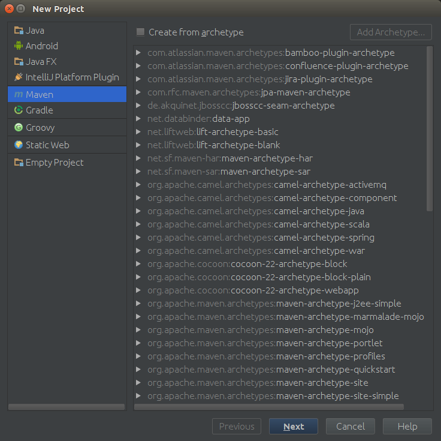
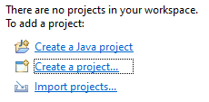
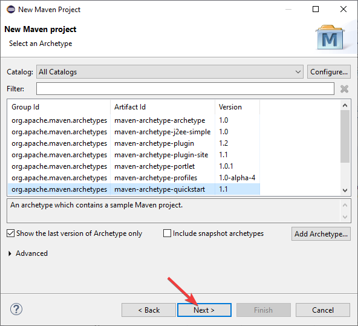
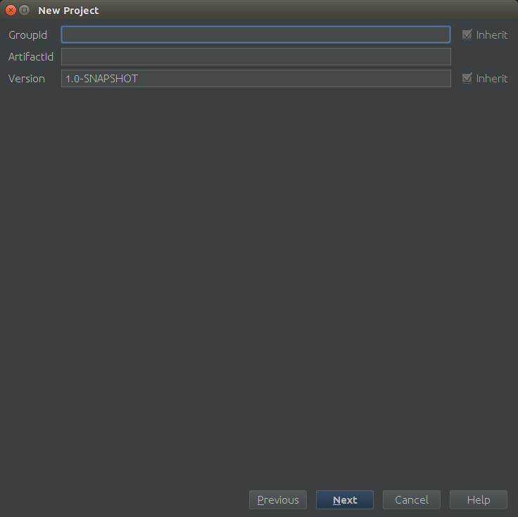
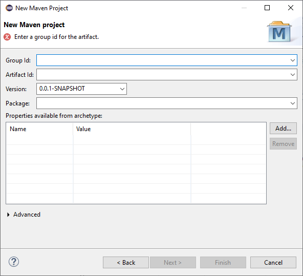
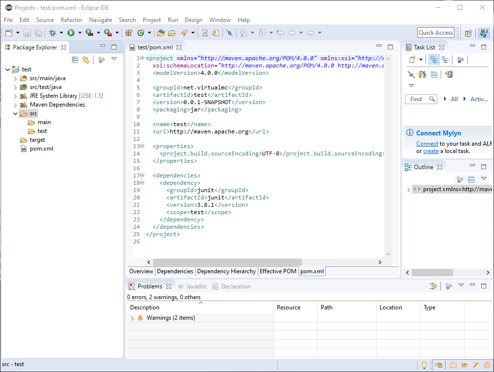
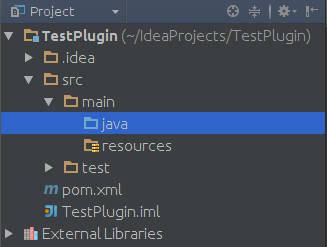

# 创建你的第一个 BungeeCord 插件
恭喜你决定创建你的第一个 BungeeCord 插件！本篇教程将让你快速入门。

本教程需要具有 Java 知识才能阅读。

::: tip
如果你迫不及待，想快速开始开发，你可以使用此[工具](https://utilities.shall.fail/bungeecord/pluginhelper/)得到项目框架，按照以下步骤导入它 File -> Import Project in IntelliJ IDEA or File -> Import -> Maven -> Existing Maven Projects in Eclipse （反复点击下一步），并继续阅读Wiki上的其他教程。你还应该继续阅读本篇教程，特别是编译部分。
:::

## 设置你的项目
本教程仅涵盖 IntelliJ IDEA，但是其他的IDE应该也是相似的步骤。

首先打开你的IDE，创建一个新项目，然后选择Maven。你的界面应该类似于这样：


::: details Eclipse用户所需的操作
创建一个新项目：



选择Maven：


:::

点击下一步（Next），然后你将会看到这个界面：


::: details Eclipse用户所需的操作

:::

在 GroupId 中，输入你的 Java 包名 （例如 *me.username*）。在 ArtifactId 中， 输入你的插件名称（接下来我们使用 TestPlugin 作为例子）。暂时不用理会 Version，点击下一步（Next）。将你的项目名称更改为你的插件名称，然后点击 "完成（Finish）"。

IDE 将会打开一个名为 *pom.xml* 的文件。现在我们要添加一些内容到其中。在 `</project>` 之前添加以下内容：

::: details Eclipse用户所需的操作
你需要将下列代码中的`<dependencies>`中的依赖项放入你的*pom.xml*文件中的`<dependencies>`下。



你不需要知道为什么要这样做，但需要你在Eclipse中编辑它。
:::

```xml
    <repositories>
        <repository>
            <id>bungeecord-repo</id>
            <url>https://oss.sonatype.org/content/repositories/snapshots</url>
        </repository>
    </repositories>

    <build>
        <plugins>
            <plugin>
                <groupId>org.apache.maven.plugins</groupId>
                <artifactId>maven-compiler-plugin</artifactId>
                <version>3.5.1</version>
                <configuration>
                    <source>1.7</source>
                    <target>1.7</target>
                </configuration>
            </plugin>
        </plugins>
    </build>

    <dependencies>
        <dependency>
            <groupId>net.md-5</groupId>
            <artifactId>bungeecord-api</artifactId>
            <version>1.10-SNAPSHOT</version>
            <type>jar</type>
            <scope>provided</scope>
        </dependency>
        <dependency>
            <groupId>net.md-5</groupId>
            <artifactId>bungeecord-api</artifactId>
            <version>1.10-SNAPSHOT</version>
            <type>javadoc</type>
            <scope>provided</scope>
        </dependency>
    </dependencies>
```

这将为你的项目添加 BungeeCord 依赖。如果你使用的是 IntelliJ，它将会询问你是否要导入 *pom.xml* 文件的更改。导入它们。如果它询问语言版本被改变，允许它重载项目。

## 创建你的主类
接下来，展开 *TestPlugin*，然后展开 *src*，再展开 *main*。现在看起来大概是这样：



右键 *java*，然后创建一个新的包。叫做 *me.username.testplugin*。接下来，右键刚刚创建的包，然后创建一个新的类，叫做 *TestPlugin*。现在 IDE 应该已经打开文件给你了。如果没有打开，那么现在打开它。

现在，我们可以制作一个基本的插件了。本篇教程的插件将不实现任何功能，除了在启动时显示一条消息。其他的教程将详细介绍所有功能，你可以制作另外的插件。

将 `extends Plugin` 添加在 *TestPlugin* 之后 *{* 之前。现在看起来应该像这样：

```java
package me.username.testplugin;

import net.md_5.bungee.api.plugin.Plugin;

public class TestPlugin extends Plugin {
    @Override
    public void onEnable() {
        // You should not put an enable message in your plugin.
        // BungeeCord already does so
        getLogger().info("Yay! It loads!");
    }
}
```
## 使插件载入
现在我们可以创建 *plugin.yml* 文件，使 BungeeCord 知道这是一个插件并告诉它如何载入本插件。右键 *resources*，然后创建一个叫做 *plugin.yml* 的文件。在文件中添加以下内容：

```yml
name: TestPlugin
main: me.username.testplugin.TestPlugin
version: 1.0
author: username
```
如果 *plugin.yml* 已经由 Bukkit 载入了，你也可以创建一个 *bungee.yml* 文件。

## 编译
我们即将完成插件的制作了。现在是编译插件的时候了。展开右边的 Maven Projects 面板（如果你没有看到它，点击 *View* 然后点击 *Tool Buttons*）， 展开你的项目，展开 *Lifecycle*，双击 *clean*，然后双击 *package*。Maven 将会马上编译你的项目。现在，打开你的项目文件夹，然后在 *target* 看到你的插件。把它安装在你的 BungeeCord 然后启动它。如果有一行显示类似于 `[INFO] Enabled plugin TestPlugin version 1.0 by username` 的信息，那么它就已经运行了，现在你已经创建了你的第一个 BungeeCord 插件！若要重新编译它，重复这些操作。

## 关于 Bukkit 开发者
如果你是 Bukkit 开发者，所有东西你似乎非常熟悉，这是因为 BungeeCord API 很大程度上受 Bukkit API 的影响。许多概念（EventHandler 和 Scheduler）保持不变，一些类和方法名称也是相同的。