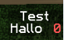

# BungeeCord 记分板 (无 API)
 
@md_5 和 @Thinkofdeath 创建 Bungeecord 记分板 API (net.md_5.bungee.api.score.*) 很长时间了。但它还没有准备好使用。不过他们已经实现了一些包装。所以我们可以用它们来创建记分板。在下面的代码示例中 p 表示 ProxiedPlayer 对象。

## 记分板是如何工作的？
通过 BungeeCord 创建记分板，了解其如何工作是非常重要的。最好的方式是在[这里](http://wiki.vg/Protocol#Scoreboard_Objective)。

## 创建一个变量
现在我们知道记分板是如何工作了。首先我们需要创建一个变量`（译者注：objective没有准确的翻译，另有译作"目标"）`
```java
ScoreboardObjective objective = new ScoreboardObjective("test", "Test", "integer", (byte) 0);
p.unsafe().sendPacket(objective);
```
解释：
- "test" 是记分板的唯一名称
- "Test" 是记分板显示的名称
- "integer" 或者使用 "hearts" - [更多信息](http://wiki.vg/Protocol#Scoreboard_Objective)
- 0 - 0 表示创建记分板。1 表示移除记分板。2 表示更新显示文本。

## 创建或删除一个分数
```java
ScoreboardScore score = new ScoreboardScore("Hallo", (byte) 0, "test", 0);
p.unsafe().sendPacket(score);
```
解释：
- "Hallo" 是要更新或删除的分数的名称
- 0 - 0表示创建或更新一个分数。1表示移除一个分数。
- "test" 是分数所属的变量的名称
- 0 - 是显示在条目旁边的分数

## 显示记分板
现在客户端知道这个记分板的所有信息了，但是我们必须告诉客户端显示这个记分板。
```java
ScoreboardDisplay display = new ScoreboardDisplay((byte) 1, "test");
p.unsafe().sendPacket(display);
```
解释：
- 1 - 记分板的位置。0: 列表，1: 侧边栏，2: 名字下方。
- "test" - 要显示的记分板的唯一名称。

就是这样，看起来非常简单。如果所有的代码都能正常运作，那么结果如下所示：



## 附注
客户端只在游戏中接收这些数据包。这意味着，如果你想在某个玩家加入游戏时向他们发送记分板，你最早可以在`ServerSwitchEvent`事件（该事件也在你第一次加入服务器时发布）将记分板发送给他们。所有更早的事件（比如`PostLogin`或`ServerConnected`）都是在客户端准备就绪前发布的。